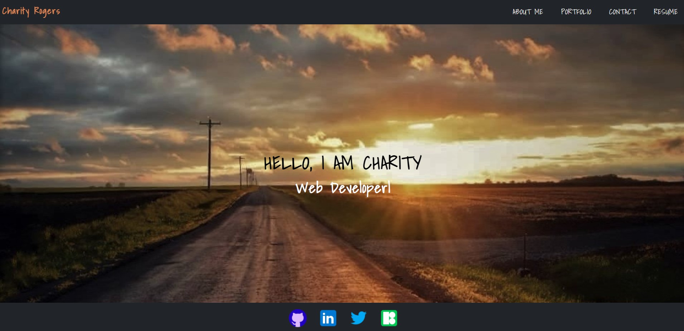

# Charity's Portfolio V2.0

## License

## Description
My single-page application portfolio created with React.

Deployed application: https://rogerscl116.github.io/portfolio-version-2.0/

### Screenshot
#### Home

#### About

## Table of Contents
 * [Installation](#installation)
 * [Usage](#usage)
 * [Contributing](#contributing)
 * [Questions](#questions)
        
## Installation
Clone this repository and enter `npm install` in the terminal to install the necessary dependencies.
   
## Usage
Enter `npm start` to connect to the localhost and open the application.

## Contributing
Charity Rogers

## Questions
If you have any questions, please contact me!

  - GitHub: https://github.com/rogerscl116
  - Email: rogerscl116@gmail.com 
